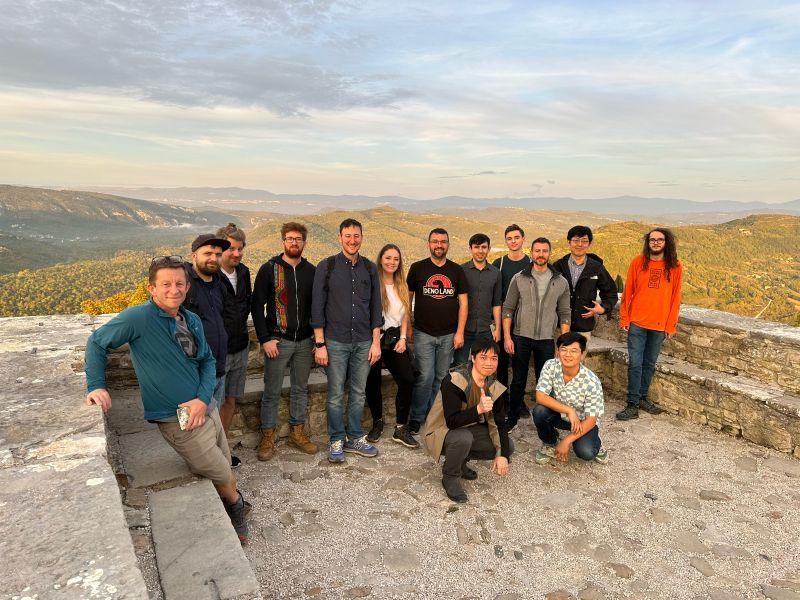
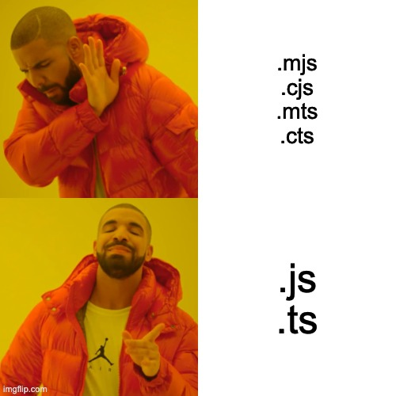
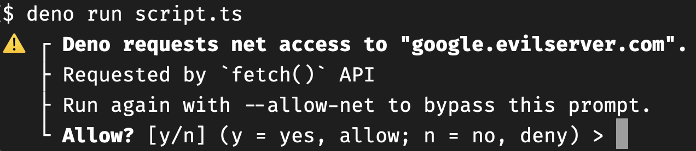
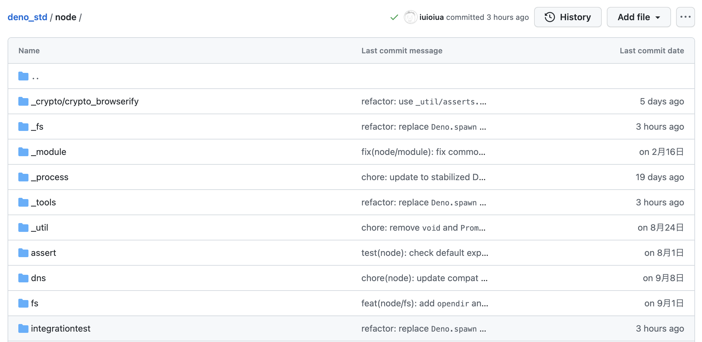
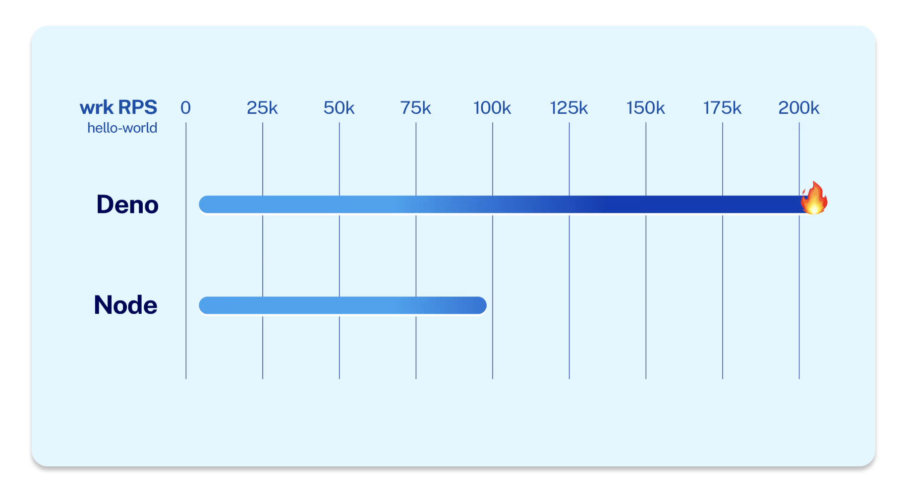
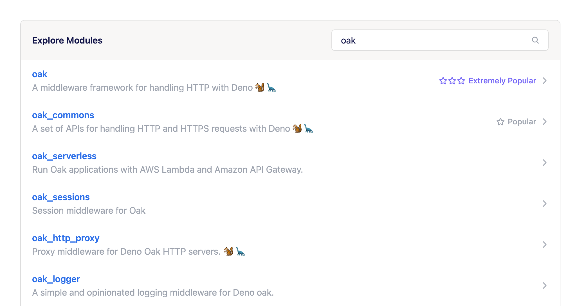
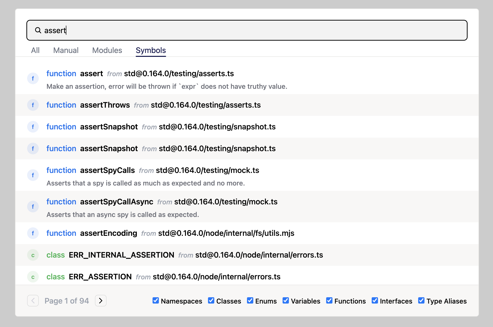

class: middle, center

Deno の最近の動向 2022


---
class: middle, center
資金調達 - 6月

$21M

<p style="text-align: center; margin-left: -100px">
  <a href="https://deno.com/blog/series-a">
    
  </a>
</p>

---
class: middle, center

Bun の登場 - 7月

<p style="text-align: center;">
  
</p>

---
class: middle, center

npm 互換性リリース - 8月

<p style="text-align: center;">
  
</p>

---
class: middle, center

Deno Offsite - 10月

<p style="text-align: center;">
  <a href="https://www.linkedin.com/feed/update/urn:li:activity:6987764898244034560" target="_blank">
    
  </a>
</p>

---
class: middle, center

イベントが盛りだくさんだった 2022

---
class: middle, center

2022 の Deno の変化のキーとなったブログポスト

---
class: center middle

[Big Changes Ahead for Deno](https://deno.com/blog/changes) - 8月


<small>今日は主にこれの話をします</small>

---


# 話す人

日野澤歓也 twitter @kt3k

- <small>Web エンジニア (2009 - 現在)</small>
- <small>Deno Land, ソフトウェアエンジニア (2021 - 現在)</small>

<small>2018年(プロジェクト初期)から OSS としての Deno にコントリビュート。2020年作者に誘われ Deno Land に転職。現在はフルタイムで Deno と Deno Deploy を開発中</small>

---
本日のアジェンダ

- Deno のおさらい
- Big Changes in 2022

---
class: middle center

Deno とは

---
class: middle center

DX (開発体験) にフォーカスした<br />JavaScript runtime

---
DX にフォーカスした JavaScript runtime

- ビルトイン開発ツール
  - `deno lint`
  - `deno fmt`
  - `deno test`, etc

cf. `prettier` `eslint` `jest` `vitest`

---
Deno の DX
- TypeScript ビルトイン
  - 設定不要、インストール不要

---
Deno の DX

- 整理されたモジュール機構
- Node, Bun
  - 🤷 CJS <-> ESM interop
  - 🤷 `.cjs` `.mjs` `.cts` `.mts`
  - 🤷 `{ "type": "module|commonjs" }`
- Deno
  - ✅ ESM only
  - ✅ .ts .js

---
class: middle center inverse



---
Deno の DX

- サプライチェーン攻撃に対する防御機構



--

<small>内部で V8 のサンドボックス機構を利用している</small><br />
<small>詳細は公式ドキュメント [Permission ページ](https://deno.land/manual@v1.27.2/basics/permissions) 参照</small>

---
Deno の DX

- Web 互換 API
  - `fetch()`
  - TypedArray - `Uint8Array` etc
  - `prompt()`

--

<br /><br />
<small>ブラウザで使える知識と同じ知識で Deno のコードが書ける</small><br />

--
<small>Deno で使える Web API 一覧はブログ記事 [list of every web API](https://deno.com/blog/every-web-api-in-deno) 参照</small><br />

---
class: middle center

Deno は JS runtime のあるべき姿を模索している

---
class: center middle

[Big Changes Ahead for Deno](https://deno.com/blog/changes)


---
Big Changes

Deno に今後起こる3つの変化を表明したブログ記事

- npm 互換性
  - 何らかの形の npm 互換性を入れる

--
- パフォーマンス向上
  - HTTP、起動速度、文字列エンコード速度 etc
  - 最も速い JS runtime であることを目指す

--
- DX 向上
  - モジュール検索性

---
class: middle center

npm 互換性

---
npm 互換性

npm モジュールとの互換性を導入すると宣言 - 8月
--

- `npm:` specifier の(正式)導入 - 11月


--
```ts
import express from "npm:express";
const app = express();
app.get('/', (req, res) => {
  res.send('Hello World!');
});
app.listen(3000);
```

--

<small>`npm:モージュル名` をインポートすると npm モジュールが自動的にダウンロード&インポートされる</small>

---
npm 互換性

ちなみに登壇者 ( @kt3k ) は npm 互換機能の Node.js 互換 shim 実装を主に担当中

- Deno 標準モジュールの `node/` 以下に、Node.js の `lib/` 以下に相当する API を移植中

<p style="text-align: center">
  
</p>

---
パフォーマンスの向上

- パフォーマンスだけを専門的にやるチームが発足

--
- Deno.serve (コードネーム `Flash`) API が実験的にリリース
  - 既存の Deno.serveHttp よりも圧倒的に速い

--

<p style="text-align:center">
  
</p>

---
DX 向上

Deno はモジュールの検索性が悪いという問題があった。
- たとえば oak という Web Framework が Deno 界では有名
- Deno レジストリで oak を検索すると何故か 2ページ目に oak 本体が表示されていた

---
DX 向上
- 人気順を加味したモジュール検索を実装

<p style="text-align:center">
  
</p>

---
DX 向上

- シンボル検索機能を実装
  - 本体、標準モジュール、3rd パーティのすべてから export されているシンボルを横断的に検索

--

<p style="text-align:center">
  
</p>

---
class: middle center

Big Changes のブログポストから<br />
Deno の中でのプライオリティがかなり明確化され<br />
目的意識をもった深い開発が行われるようになった


---

まとめ

- Deno は DX にフォーカスした JS runtime
- 現在の Deno は「パフォーマンス」「npm 互換」「開発体験向上」の3つの軸で開発が進んでいる

---
class: middle center


End
